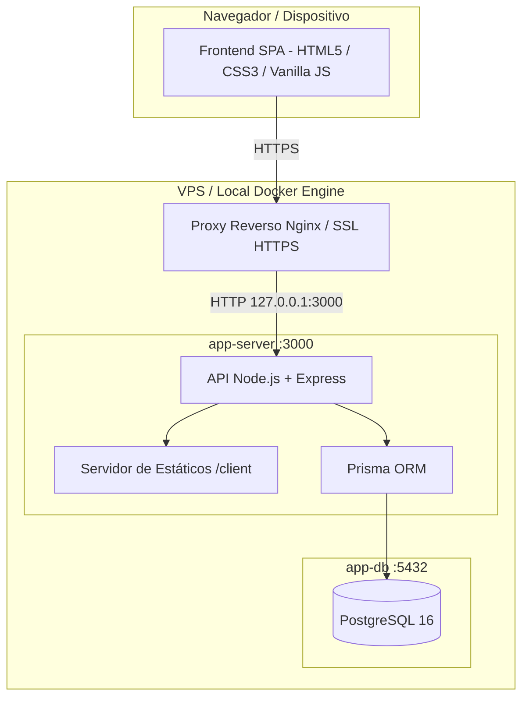

# ⚡ kWhub (Central & Calculadora de Recarga VE)

Aplicação web interativa para simulação, planejamento e dimensionamento de recargas para veículos elétricos (BEV - *Battery Electric Vehicles*) e híbridos plug-in (PHEV - *Plug-in Hybrid Electric Vehicles*), homologada com a base oficial de veículos e parâmetros do Programa Brasileiro de Etiquetagem Veicular (PBEV / Inmetro).

---

## 📌 Visão Geral

O **kWhub** permite a condutores, frotistas e entusiastas calcular com precisão:
- **Tempo estimado de recarga** em corrente alternada (AC - tomadas e wallboxes) e corrente contínua (DC - carregadores ultra-rápidos).
- **Curva e limitação de potência** de acordo com a capacidade máxima aceita por cada veículo.
- **Custo financeiro da recarga** e autonomia recuperada com base no consumo médio (kWh/100 km).
- **Planejamento de viagens com múltiplas paradas (Multi-Stop)**, calculando o percentual de bateria na chegada e tempo de espera em cada ponto.
- **Simulador de custos comparativo** entre energia elétrica e combustíveis fósseis.

Originalmente desenvolvida como uma aplicação web e sidebar integrada ao Google Apps Script (GAS) e Google Sheets, a aplicação foi migrada para uma arquitetura moderna e independente, baseada em **Node.js, PostgreSQL e Docker**, com suporte a deploy contínuo em **VPS** com ambientes isolados de **Homologação (HML)** e **Produção (PROD)**.

---

## 🏗️ Arquitetura Alvo



### Principais Componentes:
- **Frontend (`/client`):** Single Page Application (SPA) responsiva com suporte a temas Claro/Escuro, emulador de chamadas assíncronas e interface orientada a componentes.
- **Backend (`/server`):** Servidor HTTP leve construído com Node.js e Express, disponibilizando APIs RESTful (`/api/veiculos`, `/health`, etc.).
- **Persistência (`PostgreSQL + Prisma`):** Banco de dados relacional para armazenamento da base homologada de veículos, perfis de consumo e histórico.
- **Infraestrutura (`Docker & Compose`):** Empacotamento unificado que garante paridade entre o ambiente de desenvolvimento local e os servidores de homologação e produção.

---

## 📁 Estrutura do Projeto (Pós-Migração)

```text
.
├── client/                     # Frontend desacoplado
│   ├── index.html              # Interface principal SPA
│   ├── css/
│   │   └── estilos.css         # Estilos, variáveis CSS e temas
│   └── js/
│       ├── api.js              # Camada de comunicação REST / Emulador GAS
│       └── app.js              # Regras de negócio, cálculos e eventos da UI
├── server/                     # Backend Node.js
│   ├── Dockerfile              # Imagem multi-stage de produção
│   ├── package.json            # Dependências da API
│   ├── prisma/
│   │   ├── schema.prisma       # Modelagem relacional do banco
│   │   └── seed.js             # Carga inicial com a base de veículos
│   └── src/
│       ├── index.js            # Ponto de entrada do Express
│       ├── routes/             # Definição de endpoints REST
│       └── controllers/        # Controladores e regras de negócio
├── docker-compose.yml          # Orquestrador local de contêineres
├── docker-compose.prod.yml     # Orquestrador para VPS (PROD / HML)
├── .env.example                # Modelo de variáveis de ambiente
├── guia_migracao_gas_para_vps.md # Documento técnico de referência
└── README.md                   # Esta documentação
```

---

## 🚀 Execução em Ambiente de Desenvolvimento Local (Docker)

### Pré-requisitos
- [Docker Engine](https://docs.docker.com/engine/install/) e [Docker Compose](https://docs.docker.com/compose/) instalados.
- [Node.js 20+](https://nodejs.org/) (opcional, apenas para desenvolvimento fora do contêiner).
- [Git](https://git-scm.com/).

### Passo a Passo

1. **Clonar o repositório:**
   ```bash
   git clone git@github.com:cfgaspar10/kwhub-app.git
   cd kwhub-app
   ```

2. **Configurar as variáveis de ambiente:**
   Copie o arquivo de exemplo para `.env`:
   ```bash
   cp .env.example .env
   ```

   *Exemplo de configuração para desenvolvimento local:*
   ```ini
   NODE_ENV=development
   APP_PORT=3000
   APP_BIND_IP=0.0.0.0
   APP_CONTAINER_NAME=ev-calc-app-local
   DB_CONTAINER_NAME=ev-calc-db-local

   POSTGRES_USER=postgres
   POSTGRES_PASSWORD=postgres
   POSTGRES_DB=ev_calculator_dev

   APP_SECRET=segredo_dev_temporario_12345
   ```

3. **Subir os serviços via Docker Compose:**
   ```bash
   docker compose up -d --build
   ```

4. **Aplicar Migrações e Carregar Base de Veículos (Seed):**
   ```bash
   docker compose exec app-server npx prisma migrate dev --name init
   docker compose exec app-server node prisma/seed.js
   ```

5. **Acessar a aplicação:**
   Abra no navegador: [http://localhost:3000](http://localhost:3000)

6. **Verificar os logs dos serviços:**
   ```bash
   docker compose logs -f
   ```

7. **Encerrar a aplicação:**
   ```bash
   docker compose down
   ```

---

## 🌐 Estratégia de Ambientes e Git Flow

O ciclo de vida do software segue o modelo de ramificação integrado à esteira de CI/CD:

| Ambiente | Branch Git | Porta VPS | Subdomínio / URL | Banco de Dados |
| :--- | :--- | :--- | :--- | :--- |
| **Local (Dev)** | `feature/*` ou `fix/*` | `3000` | `http://localhost:3000` | `ev_calculator_dev` |
| **Homologação (HML)** | `develop` | `3001` | `https://hml.seudominio.com` | `ev_calculator_hml` |
| **Produção (PROD)** | `main` | `3000` | `https://app.seudominio.com` | `ev_calculator_prod` |

### Fluxo de Trabalho
1. Novas funcionalidades e correções são desenvolvidas localmente no Docker a partir de branches de apoio.
2. Pull Requests aprovados são mergeados em `develop`. O GitHub Actions dispara a atualização automática do ambiente HML na VPS via VPN Tailscale.
3. Após validação em HML, é realizado o merge de `develop` para `main`. O GitHub Actions atualiza automaticamente o ambiente de Produção.

---

## 🛠️ Tecnologias Utilizadas

- **Interface:** HTML5, CSS3 Moderno (Custom Properties, Flexbox, Grid), JavaScript (ES6+ Vanilla).
- **Backend:** Node.js, Express, Helmet, CORS.
- **Banco de Dados:** PostgreSQL 16 com Prisma ORM.
- **Conteinerização:** Docker & Docker Compose.
- **Rede e Segurança na VPS:** Nginx (Proxy Reverso), Certbot (SSL Let's Encrypt), Tailscale (VPN de Acesso e CI/CD).
- **Automação:** GitHub Actions (Deploy Contínuo).

---

## 📚 Documentação Complementar

- [Guia Definitivo de Migração GAS para VPS](guia_migracao_gas_para_vps.md): Blueprint de arquitetura e segurança.
- [Plano de Implementação e Cronograma](docs/plano_implementacao_e_cronograma.md): Cronograma detalhado em 10 atividades e matriz de riscos.
- [Guia dos Ambientes HML e PROD](docs/guia_ambientes_hml_prod.md): Configurações de Stacks, Nginx, SSL e Secrets do GitHub Actions.

---

## 📄 Licença e Manutenção

Projeto mantido para dimensionamento e mobilidade elétrica. Repositório oficial: [cfgaspar10/kwhub-app](https://github.com/cfgaspar10/kwhub-app).
