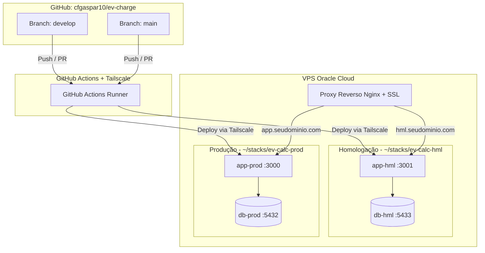

# 📋 Plano de Implementação e Cronograma Executivo: Migração EV Charging Calculator

Este documento oficializa o plano técnico e cronograma para migração da aplicação **EV Charging Calculator** do ecossistema Google Apps Script para arquitetura conteinerizada em VPS (Docker, PostgreSQL, Nginx, Tailscale e CI/CD).

---

## 1. 🎯 Objetivos do Projeto
* Desacoplar a aplicação do ambiente Google Apps Script e Google Sheets.
* Estruturar o desenvolvimento local sobre contêineres Docker (Node.js + PostgreSQL 16 com Prisma ORM).
* Criar uma esteira de versionamento profissional com branches `develop` (Homologação - HML) e `main` (Produção - PROD).
* Configurar e proteger a VPS (Oracle Cloud / Ubuntu) com Tailscale VPN, Swapfile e Nginx com SSL Let's Encrypt.
* Automatizar o deploy contínuo com GitHub Actions direcionado ao repositório `git@github.com:cfgaspar10/ev-charge.git`.
* Garantir rotinas de backup diário com retenção de 15 dias.

---

## 2. 🗺️ Arquitetura dos Ambientes

---

## 3. 📅 Cronograma Detalhado de Atividades

| Atividade | Fase | Tarefas Envolvidas | Duração Estimada | Dependência | Entregável |
| :---: | :---: | :--- | :---: | :---: | :--- |
| **01** | **Fase 1** | Extração do `Index.html` em `client/index.html`, `client/css/estilos.css` e `client/js/app.js`. Criação do adaptador `client/js/api.js`. | 1 dia | Início | Frontend desacoplado e funcional |
| **02** | **Fase 1** | Criação do backend Express em `server/src/`, modelagem relacional Prisma (`schema.prisma`) e script de seed da base de veículos (`seed.js`). | 1 a 2 dias | Ativ. 01 | API REST com endpoints `/api/veiculos` |
| **03** | **Fase 2** | Criação do `server/Dockerfile` multi-stage, `docker-compose.yml` e arquivo `.env.example` para ambiente local. | 1 dia | Ativ. 02 | Docker local funcional com PostgreSQL |
| **04** | **Fase 2** | Execução e validação ponta a ponta dos cálculos, seleção de veículos e persistência localmente via Docker. | 1 dia | Ativ. 03 | Homologação local concluída com sucesso |
| **05** | **Fase 3** | Criação da branch `develop`, ajuste fino do `.gitignore`, commits estruturados e envio ao repositório GitHub. | 0.5 dia | Ativ. 04 | Repositório `ev-charge` sincronizado com branches ativas |
| **06** | **Fase 4** | Preparação da VPS: regras de firewall (`iptables` e Security Lists), Swapfile de 4GB a 8GB, Docker e Tailscale. | 1 dia | Ativ. 05 | VPS segura e conectada à malha Tailscale |
| **07** | **Fase 5** | Configuração dos diretórios de Stacks na VPS (`~/stacks/ev-calc-hml` e `~/stacks/ev-calc-prod`) com variáveis `.env` independentes. | 0.5 dia | Ativ. 06 | Contêineres de HML (:3001) e PROD (:3000) ativos |
| **08** | **Fase 5** | Configuração do Proxy Reverso Nginx e emissão automática de certificados SSL com Certbot. | 0.5 dia | Ativ. 07 | URLs públicas HTTPS acessíveis com segurança |
| **09** | **Fase 6** | Configuração dos Secrets no GitHub e implementação do workflow `.github/workflows/deploy.yml`. | 1 dia | Ativ. 08 | Esteira de CI/CD automática por branch |
| **10** | **Fase 6** | Criação do script de backup diário (`backup-db.sh`) com `pg_dump` e agendamento no crontab com rotação de 15 dias. | 0.5 dia | Ativ. 09 | Política de backup testada e operacional |

**Total Estimado:** 8 a 9 dias úteis.

---

## 4. ⚙️ Matriz de Ambientes e Especificações Técnicas

| Parâmetro | Desenvolvimento Local | Homologação (HML) | Produção (PROD) |
| :--- | :--- | :--- | :--- |
| **Branch Git** | `feature/*` / `fix/*` | `develop` | `main` |
| **Porta da Aplicação** | `3000` | `3001` (na VPS) | `3000` (na VPS) |
| **Porta do Banco** | `5432` | `5433` (ou interna) | `5432` (interna) |
| **Acesso Web** | `http://localhost:3000` | `https://hml.seudominio.com` | `https://app.seudominio.com` |
| **Banco de Dados** | `ev_calculator_dev` | `ev_calculator_hml` | `ev_calculator_prod` |
| **Deploy** | Manual via Docker Compose | Automático via GitHub Actions no push em `develop` | Automático via GitHub Actions no push em `main` |
